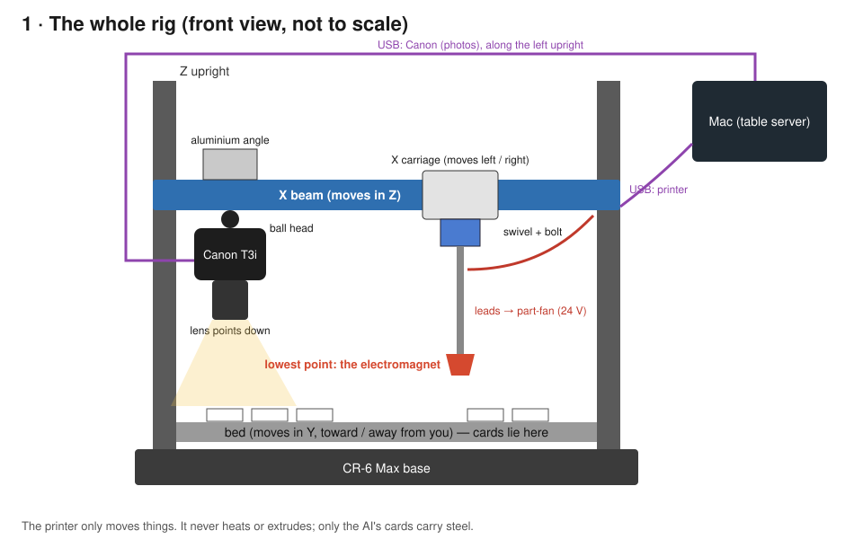
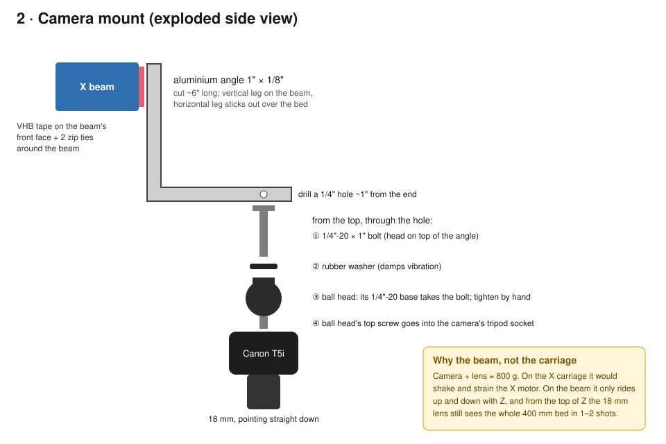
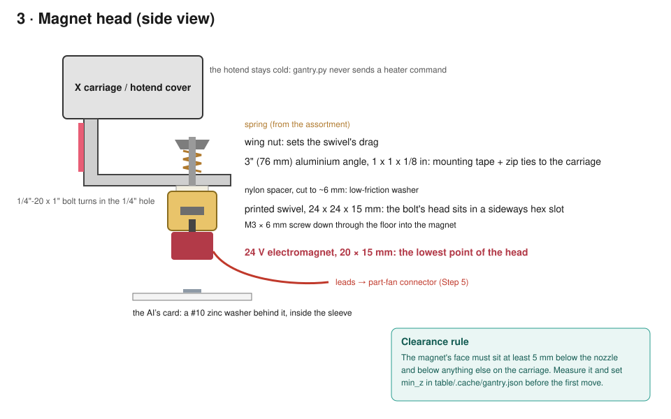
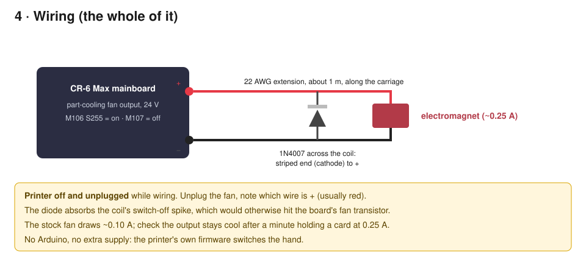
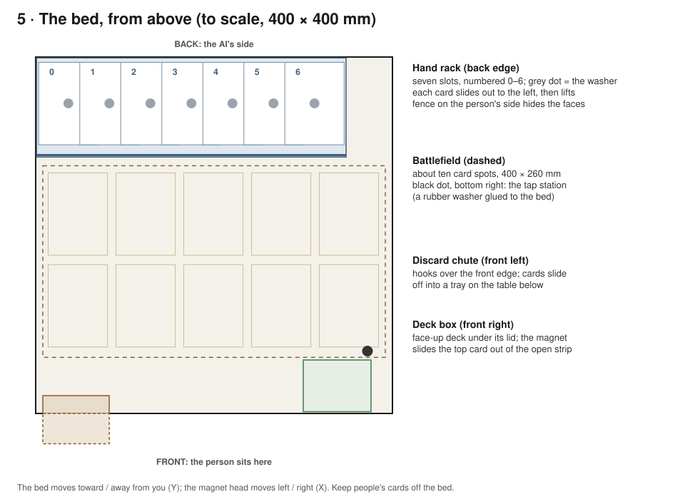

# Camera gantry + magnet hand — assembly manual

A Creality **CR-6 Max** 3D printer turned into eyes and a hand for the table. A **Canon EOS Rebel T3i** looks straight
down at the cards on the bed, and a small **24 V electromagnet** on the print head picks up the AI's cards, which
carry a steel washer inside the sleeve. The printer only *moves*: it never heats or extrudes (`table/gantry.py`
refuses those G-codes). This is the first step toward the "Jumanji table" in [docs/roadmap.md](../../docs/roadmap.md):
an AI that moves its own cards.

**Only the AI's cards have steel in them, so the magnet physically cannot lift a person's card.**

Open source (Apache-2.0, like the rest of this repository). Diagrams are hand-made SVGs in [`img/`](img/). Every part
below is listed in [`hardware/bom.json`](../bom.json), and `table/tests/bom_test.py` fails if this page and that file
disagree. **Status (2026-10-05): designed from the parts' specs, not yet assembled; reviewed by Hermes.** Step 9 is the test that
decides whether the printer is the hand or the SO-101 arm is ([docs/ARM-GANTRY-GOAL.md](../../docs/ARM-GANTRY-GOAL.md),
section M). The suction design this replaced is in git history.

**3D version:** `scripts/serve-manual3d.sh`, then open <http://localhost:8765/manual3d/>: every printed part (the real STL files) and every piece of hardware, labelled, with an exploded view of the magnet head, and three animated step-by-step guides (the magnet head, 16 steps, starting with sawing and drilling the bracket and including the swivel plug that closes the bolt's slot; sleeving a card with its washer, 8 steps; and the flip station design, 6 steps: `guide=flip`) with a scrubbable timeline. Labels carry each part's size, and a Speak button (or `S`, plus an Auto-read option) reads the current step aloud using the browser's own offline voices. Your place is saved in the browser, and every view has a link you can share or bookmark: `?view=steps&guide=sleeve&step=5` (also `view=head&explode=0.6`, `view=all&part=swivel`, `labels=all|current|off`, `follow=0`).



## Safety first

- **The CR-6 has a known USB fault.** Users have measured about 20 V on the USB connector's *shell* and lost the USB
  ports of the computer they plugged in (a short from the 24 V heated bed near the bed clips; fixed on board v4.5.3).
  Taping the cable's +5 V pin does **not** fix that; only the bed-clip fix does. Do Step 6, including the voltage
  measurement, *before* the printer's USB cable ever touches the Mac, and make the first connection through a
  spare hub or an old laptop.
- **Never run a normal print with the camera or magnet head attached.** `gantry.py` allows only motion and status
  commands (and, once added, magnet on/off).
- **Z homing drives the head down.** With anything hanging below the nozzle (the camera, the magnet head) it crashes into the
  bed or the cards. `gantry.py home` homes X and Y only, and `home --z` is refused unless you add `--clear` to say the head is
  off the carriage and the bed is clear. **Z is never assumed:** every connection starts with Z unknown, and the driver refuses
  any move with a Z in it until you say where Z is: put the NOZZLE at a measured height by hand (a sheet of paper under it,
  magnet head off) and run `gantry.py zero-z` (it sends `G92 Z0`), or `home --z --clear`. A reconnect forgets it again.
  **Homing X and Y also moves the head at whatever height it happens to be at:** before the first `home` of a session, raise the head
  by hand or from the printer's menu until it is clear of everything on the bed (the deck box is about 118 mm tall).
  `magnet_min_z` and `travel_z` have no defaults: until you measure and set them in `gantry.json`, every magnet Z move, pick,
  place, rack move and flip is refused.
  `min_z` is the CAMERA's floor; the magnet has its own, `magnet_min_z` (default 0), because `touch_z` sits below `min_z` by design.
- **Put a hardware cut-off on the magnet; the software one is not enough.** The timer lives in the Python process, and Marlin
  latches `M106 S255` until it is told `M107`. If the process dies, the Mac sleeps or the cable is pulled, the fan output
  STAYS HIGH and the magnet stays on. So a relay that opens "when the fan output goes low" does nothing for this failure: the
  output never goes low. What does work: (1) a thermal cut-off fuse (60-70 C, under $1) in series with the coil and bonded to the
  magnet's body, which ignores software completely; (2) a delay-off module on the fan output that needs a fresh edge to re-arm,
  so a latched-high output times out by itself; (3) a visible inline switch you can reach. The driver retries the off command three
  times, then refuses every other command until one succeeds, and it starts the timer before it sends the on command, but none
  of that helps over a dead cable. A carry may hold the magnet for up to `carry_max_s` (90 s); nothing may exceed 180 s; a bare
  `magnet on` is limited to `magnet_max_s` (20 s) because an energised magnet with no card on it heats (the listing warns of damage at 120 C).
- **The magnet is full-on or off, never in between.** The fan output can run at partial power (PWM); a part-powered
  magnet holds weakly and can drop a card mid-move. Only `M106 S255` and `M107` are ever sent.
- **The magnet must not stay on without a card.** The maker rates it for continuous use *under load* and warns that
  long unloaded energising overheats it. The software caps its on-time, and because a cap dies with the process that
  enforces it, the driver also sends `M107` when it exits and the table server sends it when it starts.
- **People's cards and hands stay off the bed.** The bed is the AI's side of the table; the person plays beside the
  printer.

## Parts

Prices as seen on 2026-10-04; any equivalent part works.

**Already on hand**

| Part | Qty | Used for |
|---|---|---|
| Canon EOS Rebel T3i with 18–55 mm lens | 1 | the eyes |
| Creality CR-6 Max 3D printer | 1 | prints the Step 3 parts, then becomes the gantry |
| PLA+ filament | — | the Step 3 parts |
| Zip ties | ~10 | backing up the tape, tidying cables |

**Printed (Step 3, before the printer becomes the gantry)**

| Part | Qty | Size (from the .scad / STL; TBD = measure yours) | Used for |
|---|---|---|---|
| Printed magnet swivel | 1 (+1 spare) | 24 × 24 × 15.1 mm; hex slot 11.6 mm AF; top hole 7 mm | holds the magnet and turns in its bracket |
| Printed swivel plug | 1 per swivel (10 printed in 5 fits, marked 1-5 pits on the top) | T-shaped, 7 x 11 x 8 mm; slides into the swivel's open side after the bolt | closes the hex channel and the slot so the bolt cannot slide out; keep the fit that goes in with a firm push and stays put (`parts/swivel_plug_lib.scad`; v1 had crush ribs and bound: removed) |
| Printed deck box with a one-card exit slot | 1 | 73.3 × 99.3 × 117.8 mm; `card_t` 1.6 mm TBD | the AI's shuffled deck, face-up and covered; one card out at a time |
| Printed deck box follower plate | 1 | 67.5 × 93.5 × 3.0 mm | rides on four springs, keeping the top card at the exit slot |
| Printed discard chute | 1 | 74.5 × 90.1 × 52.4 mm; 35° ramp; `bed_t` 6 mm TBD | graveyard and exile go off the bed's edge into a tray |
| Printed hand rack | 1 | 349.3 × 40.0 × 111.3 mm; 7 slots, 46 mm pitch; `card_t` 1.6 mm TBD | the AI's hand: seven cards in a staircase on the bed's back edge, faces hidden by its fence |
| Printed sleeving jig tray | 1 | 72.9 × 98.9 × 9.6 mm; card pocket 68.1 × 94.1 mm | holds a card while its washer goes on |
| Printed sleeving jig bridge | 1 | 72.9 × 24.0 × 5.0 mm; hole for an 11.1 mm washer | drops every washer at the card's centre |
| Printed lead clip | 4 | 14 × 16 × 7.8 mm; holds 5 mm wire | the magnet's leads, with slack for the swivel |

**Check you have these (buy only if missing)**

| Part | Qty | Used for |
|---|---|---|
| 22 AWG two-core wire, about 1 m | 1 | extending the magnet's leads to the part-fan connector |
| Kapton (polyimide) tape | 1 roll | under the bed clips, and over the USB cable's +5 V pin |
| Micro-USB cable for the printer (came with it) | 1 | printer to the Mac |
| USB-C to USB-A adapter | 1 | the Mac has only USB-C; both cables end in USB-A |
| Card sleeves, inner and outer, for the AI's deck | 2 per card | the washer sits between them |
| Non-slip shelf liner, cut to the bed | 1 | stops the moving bed from sliding the AI's cards |
| Multimeter | 1 | the USB-shell voltage check (Step 6) and the 24 V check (Step 5) |

**Hardware store (The Home Depot, via Instacart) — $58.96**

| Part | Qty | Used for |
|---|---|---|
| Everbilt aluminium angle 1" × 3 ft × 1/8" | 1 | camera bracket (~6" / 152 mm) and magnet bracket (3" / 76 mm; 1/4" / 6.35 mm hole 1" / 25.4 mm from one end) |
| Everbilt 1/4"-20 × 1" (6.35 × 25.4 mm) zinc hex bolt | 4 | camera bracket; the swivel's axle; spares |
| Everbilt 1/4"-20 (6.35 mm) wing nut (4-pack) | 1 | setting the swivel's drag |
| Everbilt nylon spacer 1/2" (12.7 mm) × 1" (0.257" / 6.5 mm bore) | 2 | cut down to 6 mm: a low-friction washer under the bracket |
| Everbilt 1/4" rubber flat washers (10-pack) | 1 | damping under the ball head; the tap station's grippy foot |
| Everbilt spring assortment kit (84-pack) | 1 | one compression spring for the swivel's drag (about 8 mm wide; length TBD) |
| Scotch Extreme double-sided mounting tape 1" × 48" | 1 | brackets to the beam and the carriage (no drilling into the printer) |
| Everbilt M3 × 6 mm zinc flat head machine screws (4-pack) | 1 | magnet to the printed swivel (the magnet has an M3 thread in its back) |
| Commercial Electric 4" heat-shrink tubing assortment (8-pack) | 1 | insulating the diode and the lead splices |
| Everbilt #10 zinc flat washers (100-pack; 0.438" / 11.1 mm OD) | 1 | one per AI card, inside the sleeve (zinc-plated steel is magnetic; stainless mostly isn't) |

**Online (Amazon) — the exact parts.** Only the first two are in the cart ($13.18): the M1 test kit. The rest
are in *Save for later* until the deck-stack test in Step 9 passes 19 times out of 20; M1 uses the table's
existing fixed camera, so the Canon mount waits too.

| Part | Link | Price |
|---|---|---|
| Heschen 24 V holding electromagnet HS-P20x15 | [amazon.com/dp/B078K3TKFZ](https://www.amazon.com/dp/B078K3TKFZ) | $7.19 |
| 1N4007 rectifier diodes (125-pack) | [amazon.com/dp/B0FC2CQF24](https://www.amazon.com/dp/B0FC2CQF24) | $5.99 |
| Gonine LP-E8 dummy battery / ACK-E8 AC kit | [amazon.com/dp/B01EMNB8P6](https://www.amazon.com/dp/B01EMNB8P6) | $19.99 |
| SCOVEE 10 ft Mini-USB camera cable for Canon Rebel | [amazon.com/dp/B078SRKRLK](https://www.amazon.com/dp/B078SRKRLK) | $8.55 |
| CAMVATE 1/4"-20 mini ball head (2-pack) | [amazon.com/dp/B07D9JCP18](https://www.amazon.com/dp/B07D9JCP18) | $9.80 |
| RSHTECH 7-port powered USB hub (USB-C and USB-A) | [amazon.com/dp/B0CGX8LNMC](https://www.amazon.com/dp/B0CGX8LNMC) | $31.99 |

The Amazon cart reads **$13.18**. Save for later holds the other four parts above ($70.33; the hub can be dropped if
a USB-C adapter is on hand) and the SO-101 arm, its wrist camera and its kill switch ($226.96, listed in the goal
doc), all waiting on Step 9's result.

**Tools:** drill with a 1/4" bit, hacksaw, file, screwdrivers, multimeter, wire strippers, a lighter or heat gun for
heat-shrink.

## Step 1 — Cut the brackets

Cut the aluminium angle into a **~6" piece** (camera) and a **~3" piece** (magnet head). File the edges smooth.
Drill a **1/4" hole** about 1" from one end of each piece, centred on one leg.

## Step 2 — Mount the camera on the X beam



1. **First, run the carriage from one end of the X beam to the other by hand** (printer off). On the CR-6 Max the
   carriage rides on the beam's **front** face, so nothing may be stuck there. Stick the 6" angle's *undrilled* leg to
   the **top (or back) of the X beam, outboard of the carriage's travel** (the left end), with mounting tape, the
   drilled leg sticking out over the bed. Back it up with two zip ties around the beam, and run the carriage end to
   end again: it must not touch the bracket, the ball head, the camera or its cable.
2. From the top: **bolt** down through the hole → **rubber washer** → screw the bolt into the **ball head's
   base**. Hand-tight.
3. Screw the ball head's top screw into the camera's tripod socket. Fit the **dummy battery** and plug in its AC
   adapter. Plug the **Mini-USB cable** into the camera, and route it along the left upright (it reaches the Mac
   in Step 6).
4. Set the lens to **18 mm**, autofocus off (manual focus on the bed), and point the camera straight down.

*Why the beam:* the camera and lens weigh ~800 g. On the X carriage they would shake and strain the X motor; on
the beam they only ride up and down with Z.

## Step 3 — Print the parts (while it's still a printer)

Everything here is PLA+, printed *before* Step 4, because after that the printer is the gantry. The sources are
parametric OpenSCAD files in [`parts/`](parts/) with ready STLs in [`parts/stl/`](parts/stl/); measure your cards,
sleeves and bed edge, change the numbers at the top of a file, and re-render with `scripts/build_parts.sh`.

- **Printed magnet swivel** ([`magnet_swivel.scad`](parts/magnet_swivel.scad); print a spare): 24 mm across,
  100% infill, top hole up. The magnet screws on underneath with the M3 screw, dropped in through the top hole;
  the 1/4" bolt slides in from the side, head first and thread up (the hex slot takes the head, a keyhole slot in the ceiling takes the thread), so the bolt turns *with* the swivel.
- **Printed deck box with a one-card exit slot** ([`deck_box.scad`](parts/deck_box.scad)): a card magazine. A lid
  over the rear covers only what is behind the washer's reach (the open front strip must extend past the top card's centre by the magnet's radius, or the magnet cannot land on the washer: fixed 2026-10-08); see the open question in `hardware/DESIGN-REVIEW-2026-10-08.md` about the deck's orientation; side lips hold the top card down, and the
  front wall stops exactly one card below them, so only the top card can slide out. Set `card_t` from ten sleeved
  cards with their discs, measured together.
- **Printed deck box follower plate** (the same file, `part = "follower"`): sits on four springs from the
  assortment in the box's floor sockets and pushes the stack up as cards are drawn. Pick springs that a full deck
  compresses to about `spring_room` (14 mm).
- **Printed discard chute** ([`discard_chute.scad`](parts/discard_chute.scad)): hooks over the bed's front edge
  (set `bed_t`) and drops cards into a tray: graveyard and exile need no bed space.
- **Printed hand rack** ([`hand_rack.scad`](parts/hand_rack.scad)): the AI's hand, held in front of it on the
  bed's back edge, the way a player holds their cards close. Seven slots in a staircase: each card lies flat on
  its own shelf, 46 mm right of and 3.6 mm above the one before, so its left strip (with the washer under the card's
  centre) stays open to the magnet and the camera while the rest slides under the next card's shelf. A 40 mm fence on
  the person's side hides the faces. Print it standing on the fence (the STL is already turned that way): the slots
  become upright slits and need no supports. It is ~347 mm long, so it uses most of the 400 mm bed; set `card_t` to
  the same number as the deck box.
- **Printed sleeving jig tray** ([`sleeve_jig.scad`](parts/sleeve_jig.scad)) and **Printed sleeving jig bridge**
  (the same file, `part = "bridge"`): put every washer at the centre of the card's back (Step 8), which the deck box
  and the rack both rely on. (Revised 2026-10-08: the tray is one piece, with thumb notches in its end walls only, and has stops so the bridge centres on the card. See [`hardware/DESIGN-REVIEW-2026-10-08.md`](../DESIGN-REVIEW-2026-10-08.md).)
- **Printed lead clip** ([`lead_clip.scad`](parts/lead_clip.scad), print four): tape-on clips for the magnet's leads
  (Step 5).

## Step 4 — Build the magnet head



1. Stick the 3" angle to the side of the **X carriage** with mounting tape plus zip ties, the drilled leg
   horizontal and sticking out under the carriage.
2. Screw the **magnet** to the swivel's floor from inside with an **M3 × 6 mm flat-head screw** (the head seats in the
   countersink; snug, not tight: PLA cracks), then slide a **1/4" bolt** in from the side, head first, thread up: its head into the hex slot, its thread through the keyhole slot in the ceiling.
3. Cut ~6 mm off a **nylon spacer** with the hacksaw: it's a low-friction washer. The stack, from the bottom: swivel →
   nylon washer → up through the bracket's hole → a short **spring** from the assortment → **wing nut**. The bolt
   turns in the bracket's hole. The wing nut sets the drag: tight enough that a card doesn't spin while moving, loose
   enough that it turns when its corner is held (Step 9). If the thread runs out, use a 1.5" bolt.
4. The **magnet's face must be the lowest point** of the carriage: at least 5 mm below the nozzle and everything else.

## Step 5 — Wire the magnet to the part-fan output



The part-cooling fan output is 24 V and switched by G-code: **M106 S255** = magnet on, **M107** = off. No extra
board, power supply or switch.

1. **Printer off and unplugged.** Unplug the part-cooling fan at its connector and note which wire is **+**
   (usually red).
2. Extend the magnet's leads with the **22 AWG two-core wire**, magnet **+** to the fan connector's **+**.
3. Put a **1N4007 diode** across the magnet's leads: the **striped end (cathode) to +**, the other to −. Without it the
   switch-off spike can kill the board's fan transistor. Insulate with heat-shrink.
4. Measure before trusting it: the magnet draws about **0.25 A**, the stock fan about 0.10 A. Read the board's
   version and the fan output's transistor, and if in doubt check that it stays cool after a minute of `M106 S255`
   with a card held. If it can't carry the magnet, the fallback is a MOSFET module switched by that output
   (see the goal doc).
5. Clip the leads to the bracket with two **printed lead clips**, leaving a loop of slack between the clip and the
   magnet so the swivel can turn a quarter for a tap; two more along the carriage.

## Step 6 — USB: make it safe, then connect

1. Read the version printed on the control board. v4.5.3 has Creality's fix; v4.5.2 and earlier are affected.
2. Put **Kapton tape** under the bed clips, wherever a clip or screw sits near the heater's traces. This is the fix
   for the shell fault.
3. **Measure before plugging in.** Printer on, cable plugged into the printer only: with the **multimeter** on DC
   volts, measure between the cable's USB-A plug *shell* and the Mac's ground (the metal of a USB-C port's shell, or
   any unpainted metal on a cable already plugged into the Mac). Over about **1 V**: don't plug in; recheck the bed
   clips. Hermes's suggestion: make the very first connection through a spare hub or an old laptop anyway.
4. On the printer's **micro-USB cable**, cover the **+5 V pin** (the outermost contact on one side of the USB-A
   plug) with a sliver of Kapton tape. That stops the Mac and the printer powering each other; it does nothing for
   the shell fault.
5. Connect the printer to the Mac through the **USB-C to USB-A adapter**, or the powered hub (the RSHTECH hub above)
   if it's bought later.
6. `gantry.py ports` should list the printer.

## Step 7 — Measure the rig and set limits

With the printer powered and connected, home X and Y only:

```bash
~/.venvs/table/bin/python table/gantry.py home
~/.venvs/table/bin/python table/gantry.py info
```

Cut the **non-slip shelf liner** to the bed and lay it flat: the bed moves in Y, and bare it lets cards slide.

Raise Z well above the bed, then lower it in small steps (`gantry.py goto <x> <y> <z>`) until the magnet *just*
touches a card. Write what you measured to `table/.cache/gantry.json`:

```json
{
  "min_z": 12,
  "lens_at_z0_mm": 85,
  "cam_offset_mm": [0, 0],
  "focal_mm": 18,
  "y_feed": 1200
}
```

- `min_z`: the lowest Z at which the magnet still clears the bed by ~2 mm (the touch-down height + 2).
- `lens_at_z0_mm`: lens front to bed at Z = 0 (measure at some Z and subtract).
- `y_feed`: the bed carries the cards, so Y moves slowly or the cards slide.
- `travel_z`: the head rises to at least this before any X/Y move while carrying. Set it ~10 mm above the hand rack's
  fence (Z where the magnet's face is 50 mm over the bed), so the head never crosses the fence diagonally.
- `rack`: `{"slot0": [x, y]}`, the carriage position over the centre of a card in the rack's leftmost slot. Pitch
  (46) and rise (3.6) are already the .scad's numbers; change them here if you change them there.



**Bed layout.** The hand rack along the **back** edge (the AI's side), fence toward the person. The discard chute
hooks over the **front** edge at the left; the deck box at the front right. The battlefield is the middle, about
400 × 260 mm: roughly ten card spots plus the tap station's rubber washer. Tape everything down on the shelf liner.

## Step 8 — Sleeve the AI's deck

Only the AI's deck. For each card: the card into its **inner sleeve**, then face-down into the **sleeving jig**'s
tray; set the bridge across, drop one **#10 zinc washer** through its hole, lift the bridge off, put a small piece of
clear tape over the washer so it can't wander, then slide the **outer sleeve** over both. Every washer at the centre
matters: the magnet goes to the centre of a card in the deck box, on the battlefield and in the rack. The disc sits behind the card's back, so the magnet picks the
card face-up through the card. Never put steel in a person's cards.

## Step 9 — First picks and the magnet test (M1)

M1 uses the table's existing fixed camera; the Canon on the beam waits until the result says the printer is the hand.

1. **Single picks:** place one sleeved card, move the magnet over its disc, lower to the touch-down height,
   `M106 S255`, raise 20 mm, move, pause, lower, `M107`. Repeat in different spots; note the reliable touch-down
   height. Pause briefly after every move so a card that turned stops before it's set down.
2. **Doubles, the test that decides the route:** 20 draws from a 40-card stack in the deck box with the one-card
   exit slot, sliding each top card out. Count how often a second card comes too. **Pass: at least 19 of 20.**
   - Hermes's cheap first try: a staple or a paperclip in a few sleeves instead of a disc. Less steel may couple
     less to the card below.
   - Also try tape on the magnet's face and lifting it straight out of an open box, for comparison.
3. **Tap by arc:** glue a **rubber washer** to the bed as the tap station. Put a card's corner on it, pick the card at
   its disc, lower so the corner presses on the washer, then move the magnet a quarter circle around that corner
   (G2/G3). The card turns 90°. Ten tries: within ±5° and ±3 mm? If the disc slips against the magnet instead of the
   card turning, the MG90S servo fallback is in the Amazon list.
4. **The hand rack:** fill all seven slots, then take out and put back slots 6, 0 and 3 five times each
   (`pick(**p.rack_slot(k))`, `place(**p.rack_slot(k))`). Pass: no card drags the one above or below it along, and
   every card goes back fully into its slot.
5. Record the numbers in the goal doc's section M. Nothing else gets ordered until the doubles test passes.

## Flipping a card (edge flip) — DESIGN ONLY, not built, not bench-tested

The arm has to turn the AI's real cards over (face-up to face-down and back). Only the AI's cards carry a washer; a person's card is never touched.
Everything below is a design plus digital checks (`python3 hardware/gantry/fit_check.py`, section 6). **The checks prove that nothing collides, that
every waypoint is in reach, and that a rigid card can pivot this way. They do not prove that a sleeved card grips a rubber lip, that it topples
cleanly, or that the magnet holds through the arc. The bench test below decides that.**

**What the numbers said about the first idea.** A fence that catches a card edge while the magnet lifts the washer in an arc is right, but the
magnet head as built cannot do it: its face is flat and does not pitch. Held by a level face, a card can tilt only about 20 degrees (the washer's
edge lifts off, and the pull falls with the square of the gap); the page turn needs 110. So **the head needs a passive pitch hinge, axis parallel
to the fence, placed about at the head's centre of mass** (assumed 20 mm above the face). A hinge higher up (34 mm) fails the torque check: the card's
tiny pull cannot swing a 45 g head against gravity. The washer is also at the card's *centre* (Step 8), not at an end, so the card pivots about its
LONG edge and the washer is only 33.25 mm from it; the lift is then just 33 mm.

**Parts.** `parts/flip_fence.scad` (STL in `parts/stl/`): 123.3 x 51.5 x 3.5 mm, one piece, no supports. A lip whose face leans 8 degrees over the
card; a groove in the face for a self-adhesive silicone or grip strip; two rails 94.5 mm apart (card 92.5 + 2) that guide the card as it lands; two
tape-down tabs. Fence at bed Y = 140, X = 150 (the middle of the face); a 153 x 161 mm station area, clear of the deck box, hand rack and chute.
`flip_path.py` generates the waypoints and exports JSON and G-code (`flip_path.json`, `flip_path.gcode`: reference output, never run).

**Sequence.** (1) Over the card, magnet off. (2) Down onto the washer; magnet on, hold 0.3 s. (3) Drag 8 mm so the card's long edge seats against the
fence face. (4) Arc: the washer rises along the card's pivot circle (33 mm radius) to about 33 mm up at vertical, 900 mm/min, the head tilting with
the card; the card's end corner is wedged between bed and face, then the card rests on the lip's top corner past vertical. (5) At 110 degrees the card's centre
of mass is 8.6 mm beyond the lip: magnet off, wait 0.6 s, and it topples onto the far side, back face up, washer on top. (6) Rise 35 mm straight up while the
head's light return spring levels it, then back over the card side. The flipped card is then picked normally by its washer (`pick` / `place`), which
re-registers it exactly. Landing target: washer at Y = 95.8 +/- 8 mm, X +/- 3 mm, skew +/- 5 degrees.

**Z.** The CR-6's Z moves the whole X beam; the magnet hangs from the carriage below the nozzle (5 mm with the present head; about 28 mm with a hinge,
a design number). The flip needs about 38 mm of lift of 400 and the lowest nozzle height is 29.6 mm, above the camera floor (`min_z`).

**Assumptions to bench-test (all in `fit_check.py`):** the magnet pulls about 3 N on a #10 washer through the sleeve at 0.5 mm (TBD); card + washer 3.6 g;
`card_t` 1.6 mm (TBD, measure ten); head 45 g, centre of mass 20 mm above the face; hinge friction plus return spring 1.5 mN m; the face lags the card by 3 degrees.

**Failure modes and the mitigation built in**

| Failure | Mitigation |
|---|---|
| The edge slips instead of pivoting | Leaning (undercut) face; a groove for a silicone or grip strip; the drag seats the edge first; `fit_check` says the edge only slides about 3 mm when it grips |
| The card flexes and slides off the washer | The washer is at the centre, so the card's bend is symmetric; slow arc (900 mm/min); if it slips, shorten the arc or release earlier |
| Sleeve static | Silicone strip, not bare plastic; a little anti-static spray on the sleeves |
| Two cards stuck together | The flip starts from a pick of one washer; check one card per pick (the deck box does the same) |
| The card lands on the lip | Rear slope on the fence, a margin of 8.6 mm beyond the corner at release |
| The card lands skewed | Rails 94.5 mm apart; the next pick re-registers it |
| The head swings into the bed or card on release | Head springs level only while the carriage rises; swept volume checked to clear the bed, fence, deck box, rack and chute, also with the head 1 mm bigger |

**Bench test you can do TODAY, with no electronics.** (1) Print the fence, or cut a 3.5 mm strip of cardboard or foam board and tape it down; stick a strip of
rubber or silicone on its face. (2) Sleeve one of your own *spare* cards with a #10 washer exactly as in Step 8. (3) Hold a fridge magnet or the 24 V magnet
(unpowered, on a handle, with a small hinge you can feel: a bent paper clip is enough) on the washer; stand the card's long edge against the fence face. (4) Lift
the magnet in an arc so the card pivots about the edge; at about 110 degrees pull the magnet away and let go. (5) Repeat 20 times. Record for each flip: success
(landed back up, washer on top, inside the rails), the edge slid or not (and how far in mm), the washer height needed to get past the fence, the card
slipped off the washer, landing skew in degrees. Success threshold: 18 of 20 with no card damage. If the edge slips, add grip or a steeper face; if the card
flexes off the washer, release earlier; if it will not topple, raise the release angle; if it only works with a hinged magnet and never without, the
hinge is confirmed as a requirement. Do not build the hinged head until this passes.

## Game rules on the magnet route

- **The AI never shuffles or searches its own deck physically.** Anything that shuffles the AI's library or has it
  search for a card is done by the person, without looking, and the table logs it.
- **The software never reads the AI's face-up deck before a draw.** The camera doesn't look into the deck box, and
  the table logs every frame it reads from the AI's zones, so a person can check it.
- **Two cameras:** the bed (the AI's side) is seen from above; the person's side, beside the printer, by the table's
  fixed camera. Board state merges both.

## Software notes (what still needs code)

- **Done (2026-10-05):** `gantry.py`'s gate allows exactly `M106 S255` / `M107` (no partial power, no other fan)
  and `G2`/`G3` arcs without extrusion whose whole circle stays inside the travel. The printer sends `M107` when it
  connects; a timer turns the magnet off after `magnet_max_s` (default 20 s); leaving `with Printer(...)`, an error,
  Ctrl-C or SIGTERM turn it off. Commands: `gantry.py magnet on|off`, `carry X1 Y1 X2 Y2` (pick and place in one
  run, because the magnet goes off when the program ends), `tap CX CY X Y [--ccw]`. `pick`/`place` need `touch_z`
  (measured in Step 7) in `gantry.json`. Tested against a fake Marlin board in `table/tests/gantry_test.py`,
  mutation-checked (no timer, any fan command). Still to do: a settle pause after moves, tuned on the real rig.
- **Done (2026-10-08):** `touch_z` is checked against its own floor (`magnet_min_z`), not the camera's; rack picks include the rack's
  2 mm base (`rack.base_t`); Z must be known (above); the magnet's timer retries and latches a fault; `magnet_offset_mm` (the magnet's
  axis relative to the nozzle, MEASURE IT) is applied to pick, place, rack, tap and flip; `gantry.py flip --dry-run` prints the flip's
  checked lines and a live `flip()` is refused until `flip_hinged_head_built` is true in `gantry.json` (the hinged head is a design,
  not hardware). 96 checks in `table/tests/gantry_test.py`; reverting each of those fixes fails them.
- **Before printing anything, run `fit_check.py`.** It ends with a PRE-PRINT GATE: failures are listed in `fit_check_ledger.json`, the
  run exits 0 only when every failure is on the ledger and every ledger entry still fails, and it prints which parts are cleared to
  print. `fit_check_gate_test.py` proves the gate in both directions.
- `gantry.py scan` assumes the camera rides on the **carriage**. With the camera on the **X beam**, X moves don't move
  the camera: use `snap` at the top of Z, and the scan needs a `camera_on: "beam"` setting so it moves only Z and Y.

## Troubleshooting

- **The magnet doesn't hold a card:** check the disc is centred under the magnet, the magnet's face sits flat on the
  sleeve, and that the fan output actually reads ~24 V during `M106 S255`.
- **The card sticks after M107:** the diode may be missing; leftover magnetism on a light card is otherwise rare
  (the maker rates it near zero). A strip of tape on the magnet's face helps.
- **Two cards come up from the stack:** lower the touch-down force, add the sideways wiggle, or try the fallback
  receptive sheet (goal doc, M0).
- **The card spins while moving:** tighten the wing nut a quarter turn.
- **Photos are blurry:** autofocus off, manual focus on the bed at the Z you shoot from; shake from Y moves settles
  after ~0.5 s (gantry.py waits for moves to finish).
