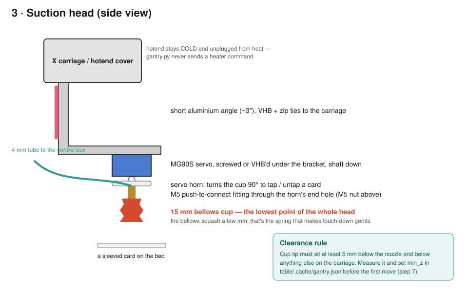
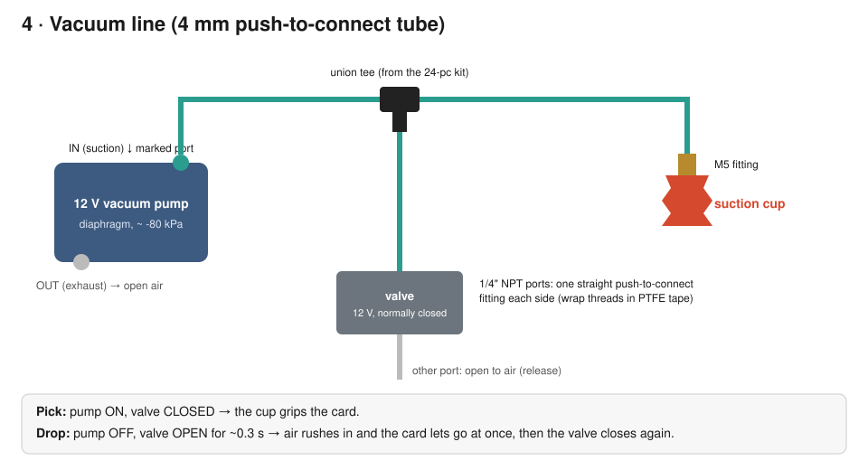
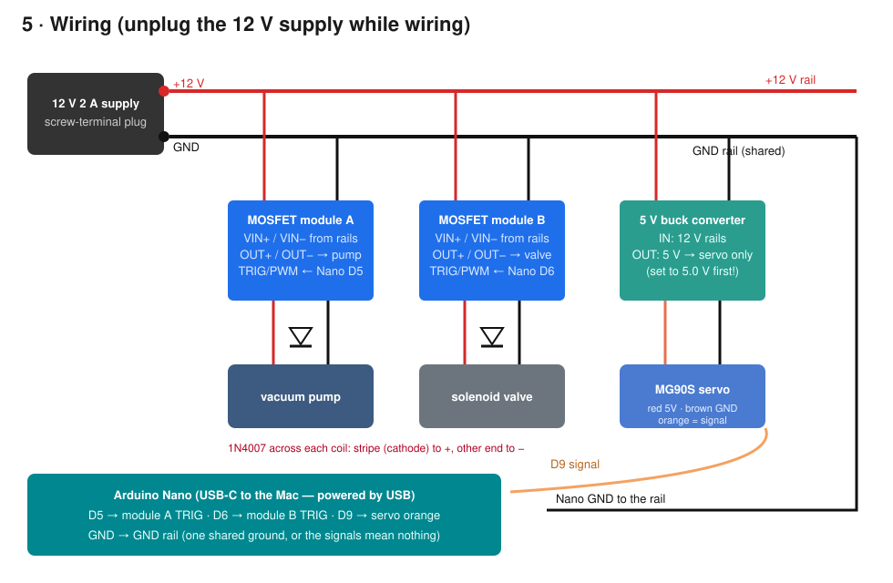

# Camera gantry + suction head — assembly manual

A Creality **CR-6 Max** 3D printer turned into a camera-and-hand for the table: a **Canon EOS Rebel T5i**
looks straight down at the cards on the bed, and a small **suction cup** on the print head can pick up a card,
turn it 90° (tap / untap) and put it down. The printer only *moves*: it never heats or extrudes
(`table/gantry.py` refuses those G-codes). This is the first step toward the "Jumanji table" in
[docs/roadmap.md](../../docs/roadmap.md) — an AI that can move its own cards.

Open source (Apache-2.0, like the rest of this repository). Diagrams are hand-made SVGs in [`img/`](img/);
edit them freely. **Status (2026-10-04): designed from the parts' specs, not yet assembled.** Expect to
adjust lengths and positions on the real printer, and please update this page with what you learn.


## Safety first

- **Unplug the printer's heaters from your mind and the software:** never run a normal print with the camera or
  suction head attached. `gantry.py` allows only motion and status commands.
- **Z homing drives the head down.** With anything hanging below the nozzle it can crash into the bed. Use
  `gantry.py home` (X and Y only) until `min_z` is measured (step 7).
- **Wire with the 12 V supply unplugged**, and check the 5 V buck converter's output with a multimeter (it should read
  about 5 V) *before* connecting the servo.
- The firmware switches the pump off after 60 s on its own and after 2 min with no commands.

## Parts

Prices as seen on 2026-10-04; any equivalent part works.

**Hardware store (The Home Depot)**

| Part | Qty | Used for |
|---|---|---|
| Everbilt aluminium angle 1" × 3 ft × 1/8" | 1 | camera bracket (~6") and suction bracket (~3") |
| 1/4"-20 × 1" zinc hex bolt | 4 | camera bracket, spares |
| 1/4"-20 wing nut (4-pack) | 1 | quick camera adjustments |
| Nylon spacer 1/2" × 1" (0.257" bore) | 2 | standoffs if the bracket needs clearance |
| 1/4" rubber flat washers (10-pack) | 1 | vibration damping under the ball head |
| Spring assortment (84-pack) | 1 | optional extra compliance for the cup |
| Scotch Extreme double-sided mounting tape 1" × 48" | 1 | brackets to the beam and the carriage (no drilling into the printer) |
| Zip ties | a few | backing up the tape, tidying tubes and cables |

**Online (Amazon or similar)**

| Part | Qty | Used for |
|---|---|---|
| Canon LP-E8 dummy battery / ACK-E8 AC adapter kit | 1 | mains power for the camera (long scans) |
| Mini-USB (USB-A to Mini-B) camera cable, 10 ft | 1 | camera to the Mac (gphoto2) |
| Mini ball head, 1/4"-20 (e.g. CAMVATE, 2-pack) | 1 | aim the camera straight down |
| 12 V micro diaphragm vacuum pump (~-80 kPa) | 1 | suction |
| 12 V 2-way normally-closed solenoid air valve, 1/4" NPT | 1 | quick release |
| 15 mm silicone bellows suction cups, M5 thread (4-pack) | 1 | the "fingertip" |
| 4 mm push-to-connect fittings kit, 1/4" NPT (straights, elbows, tees) | 1 | valve ports, tee |
| 4 mm push-to-connect × M5 male fittings | 1–2 | cup connection |
| 4 mm OD × 2.5 mm ID polyurethane tubing | ~2 m | the vacuum line |
| MG90S metal-gear micro servo | 1 | turning the cup 90° |
| Arduino Nano (USB-C, ATmega328P) | 1 | controls pump, valve and servo |
| MOSFET switch modules (5–36 V, ≥ 5 A) | 2 | switching the pump and the valve |
| 1N4007 diodes | 2 | flyback protection across the pump and the valve coil |
| 5 V buck converter, fixed output (≥ 1 A; e.g. a 6-pack of 5 V 3 A modules) | 1 | servo power (not from the Nano) |
| 12 V 2 A power supply with screw-terminal plug | 1 | pump, valve, buck converter |
| PTFE thread tape | 1 | sealing the 1/4" NPT fittings |

**Tools:** drill with a 1/4" bit, hacksaw, file, screwdrivers, PTFE tape, multimeter, small wire strippers.

## Step 1 — Cut the brackets

Cut the aluminium angle into a **~6" piece** (camera) and a **~3" piece** (suction head). File the edges smooth.
Drill a **1/4" hole** about 1" from one end of the 6" piece, centred on one leg.

## Step 2 — Mount the camera on the X beam


1. Stick the 6" angle's *undrilled* leg to the front face of the **X beam** (the beam that rides up and down in
   Z) with mounting tape, drilled leg sticking out over the bed. Back it up with two zip ties around the beam.
2. From the top: **bolt** down through the hole → **rubber washer** → screw the bolt into the **ball head's
   base**. Hand-tight.
3. Screw the ball head's top screw into the camera's tripod socket. Fit the **dummy battery** and plug in its AC
   adapter. Plug the **Mini-USB cable** into the camera and the Mac, and route it along the left upright.
4. Set the lens to **18 mm**, autofocus off (manual focus on the bed), and point the camera straight down.

*Why the beam:* the camera and lens weigh ~800 g. On the X carriage they would shake and strain the X motor; on
the beam they only ride up and down with Z.

## Step 3 — Build the suction head



1. Stick the 3" angle to the side of the **X carriage** with mounting tape plus zip ties, the other leg
   horizontal under the carriage.
2. Fix the **MG90S servo** under that leg, shaft pointing down (its mounting screws, or tape).
3. Push the **M5 push-to-connect fitting** through the end hole of the servo horn (secure with its nut), screw the
   **bellows cup** onto it, and press the horn onto the servo shaft *with the servo at 90°* (centre).
4. The **cup tip must be the lowest point** of the carriage: at least 5 mm below the nozzle and everything else.
   The bellows squash a few mm on touch-down; that is the spring. Add a spring from the assortment behind the
   bracket only if touch-downs are too hard.

## Step 4 — The vacuum line



1. Wrap the valve's threads in PTFE tape and screw a **straight 4 mm push-to-connect fitting** into each port.
2. Pump **IN** (suction port) → 4 mm tube → **tee** → one branch to the **cup**, one branch to the **valve**. The
   valve's other port stays open to the air. Pump **OUT** vents to the air.
3. Push tubes fully into the fittings (pull gently: they should not come out). Tie the cup's tube along the
   carriage with slack for the full X and Z travel.

## Step 5 — Wiring



1. 12 V supply **+** and **−** to a +12 V rail and a ground rail (the screw-terminal plug, a terminal strip or
   Wago connectors).
2. **MOSFET module A** (pump) and **module B** (valve): VIN from the rails, OUT to the pump / the valve coil.
3. A **1N4007 across each coil**: the striped end (cathode) to **+**, the other to **−**. Without them the
   switching spikes can kill the MOSFET modules.
4. **5 V buck converter** from the rails. *Before connecting anything to it*, check its output reads about **5 V** with
   the multimeter (an adjustable one: set it to 5.0 V). Then: buck 5 V → servo red, buck GND → servo brown.
5. **Arduino Nano**: D5 → module A TRIG/PWM, D6 → module B TRIG/PWM, D9 → servo orange, **GND → ground rail**
   (one shared ground, or the signals mean nothing). The Nano is powered by its USB-C cable from the Mac.

## Step 6 — Firmware

Open [`firmware/suction/suction.ino`](firmware/suction/suction.ino) in the Arduino IDE (board: *Arduino Nano*,
processor: *ATmega328P*; older clones may need *ATmega328P (Old Bootloader)*) and upload. Then, in the Serial Monitor
at **115200** baud, line ending *Newline*:

| Command | What should happen |
|---|---|
| `STATUS` | `pump=0 valve=0 turn=90` then `ok` |
| `PICK` | the pump runs; a finger on the cup feels the suction |
| `DROP` | the pump stops and the valve clicks open for 0.3 s |
| `TURN 0`, `TURN 180`, `TURN 90` | the cup turns a quarter each way and back |
| `OFF` | everything off (the safe state) |

## Step 7 — Measure the rig and set limits

With the printer powered and connected (`gantry.py ports` lists it), home X and Y only:

```bash
~/.venvs/table/bin/python table/gantry.py home
~/.venvs/table/bin/python table/gantry.py info
```

Raise Z well above the bed, then lower it in small steps (`gantry.py goto <x> <y> <z>`) until the cup *just*
touches a card. Write what you measured to `table/.cache/gantry.json`:

```json
{
  "min_z": 12,
  "lens_at_z0_mm": 85,
  "cam_offset_mm": [0, 0],
  "focal_mm": 18,
  "y_feed": 1200
}
```

- `min_z`: the lowest Z at which the cup still clears the bed by ~2 mm (the touch-down height + 2).
- `lens_at_z0_mm`: lens front to bed at Z = 0 (measure at some Z and subtract).
- `y_feed`: the bed carries the cards, so Y moves slowly or the cards slide.

## Step 8 — First picks

Place one sleeved card, move the cup over it, lower to the touch-down height, `PICK`, raise 20 mm, `TURN 0`, lower,
`DROP`. Repeat with the card in different spots and note the reliable touch-down height.

## Software notes (what still needs code)

- `gantry.py scan` assumes the camera rides on the **carriage**. With the camera on the **X beam**, X moves don't move
  the camera: use `snap` at the top of Z (the whole bed in one or two shots), and the scan needs a `camera_on: "beam"`
  setting so it moves only Z and Y. To do once the rig exists.
- The suction head will get `gantry.py pick/drop/turn` commands that talk to the Nano over its serial port, behind the
  same safety gate as the printer.
- The arduino sketch has not been compiled on this machine yet (no `arduino-cli` here); the Arduino IDE will show any
  error on upload.

## Troubleshooting

- **The cup doesn't hold a card:** check every push-fit (pull test), that the valve is *closed* during `PICK`, and that
  the cup sits flat on the sleeve. Bellows cups need the card face, not its edge.
- **The card won't let go:** the valve isn't opening (check module B, the diode direction, and that its coil gets
  12 V during `DROP`).
- **The servo jitters or the Nano resets:** the servo is drawing from the Nano. Power it from the buck converter.
- **Photos are blurry:** autofocus off, manual focus on the bed at the Z you shoot from; shake from Y moves settles
  after ~0.5 s (gantry.py waits for moves to finish).
